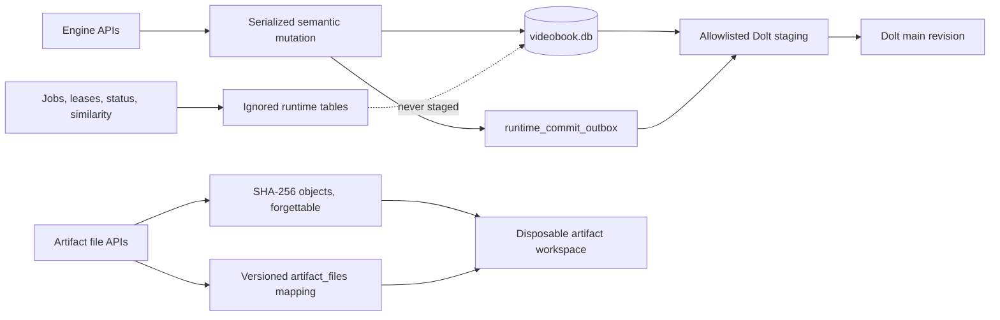
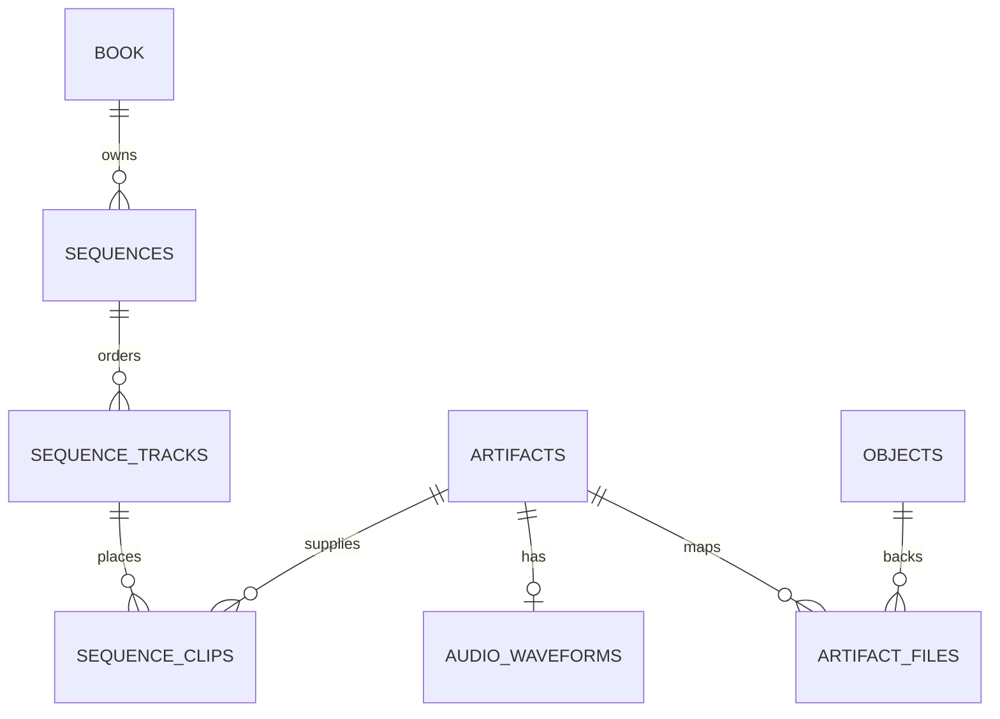

# Videobook engine layout

This document is the column-by-column layout of the engine-owned data model.
It describes the original schema version 4 layout, notes where later schema
versions changed the picture (currently v18), and identifies the additional
structures needed for a full non-linear video editor.

The executable source of truth remains
[`src/schema.ts`](../src/schema.ts). If this document and the DDL disagree, the
DDL wins. “Entire Dolt schema” below means every engine-owned, versioned table
and index plus the committed `dolt_ignore` policy; Dolt's generated internal
system tables are intentionally outside the application schema.

## Storage boundary

```text
rootDir/
├── data/
│   ├── videobook.db
│   │   ├── Dolt-versioned semantic tables
│   │   ├── committed dolt_ignore policy
│   │   └── ignored runtime_* tables and sqlite_sequence
│   └── objects/
│       └── sha256/
│           └── <first two hash characters>/
│               └── <full 64-character SHA-256>
└── workspaces/
    └── <artifact UUIDv7>/
        └── <materialized logical artifact paths>
```

The optional remote object key has the same two-character fan-out:
`<objectPrefix>/<first two hash characters>/<full SHA-256>`. The default
prefix is `superlzy-media/videobook/sha256`.



## Global invariants

- One engine catalog contains exactly one `book` row and one primary
  `sequences` row. There is no project scope.
- The only supported live Dolt branch is `main`.
- Semantic mutations are SQL transactions followed by forward-only Dolt
  commits. A restore creates a new commit; it never rewinds the live branch.
- `SEMANTIC_TABLES` is the staging allowlist. Every operation declares the
  semantic tables it may write (`OperationInput.tables`, including ON DELETE
  CASCADE targets); a commit probes exactly that set with row-level diffs,
  stages the truly dirty tables, asserts them clean afterwards, and is
  skipped when only runtime bookkeeping changed. A full-catalog sweep runs
  once per open and faults on rows no operation attributed (doltStatus
  itself over-reports and is never trusted for dirtiness). The commit itself
  is the provenance record: the operation, its parameters, write set, and
  base revision ride in a structured commit message under the configured
  identity as `--author`.
- `runtime_%`, `job_runs`, and `sqlite_sequence` are ignored by Dolt. Runtime
  state can be rebuilt, expired, or invalidated without changing semantic
  history.
- Engine-generated surrogate identities are stable UUIDv7 strings; the SQL
  columns are `TEXT`, so UUID form is enforced by engine APIs rather than a
  database check. Content identity is a lowercase, 64-character SHA-256.
- Timestamps are integer Unix epoch milliseconds. Timeline positions that are
  currently modeled use integer frames.
- JSON is stored as canonical text with recursively sorted object keys.
- Deletes are hard deletes. Owned rows cascade; live artifact/entity
  references restrict deletion; prior Dolt revisions remain available.
- Objects are content-immutable but forgettable. `engine.storage.deleteObject`
  forgets one object (refusing `IN_USE` references at HEAD unless forced);
  `engine.storage.gc` sweeps every object nothing references at HEAD.
  Forgetting is a semantic commit that sets `objects.forgotten_at`; the row
  is never deleted, so it remains as the tombstone (hash + size + forgotten
  timestamp) for historical references, and reads of forgotten content
  surface `OBJECT_UNAVAILABLE` rather than failing or lying. Published
  history is append-only, so bulk forgettable text lives behind CAS hashes
  (see "Forgettable data and raw-text audit" below).

## Dolt-versioned semantic schema

Notation used below:

- Unmarked columns are `NOT NULL`.
- `?` means nullable.
- `PK`, `UQ`, and `FK` mean primary key, unique key, and foreign key.
- `→` names the referenced column.
- Defaults and checks are shown inline.

There are 34 allowlisted semantic tables.

### Catalog, artifacts, and content

| Table | Columns | Keys, constraints, and purpose |
| --- | --- | --- |
| `engine_schema` | `singleton INTEGER`<br>`version INTEGER`<br>`created_at INTEGER` | `singleton PK CHECK(singleton = 1)`. Records the clean-break catalog version. The recorded version rejects older catalogs rather than migrating them. |
| `book` | `book_id TEXT`<br>`name TEXT`<br>`created_at INTEGER` | `book_id PK`. Exactly one row per engine root; `name` is free-text display. |
| `artifacts` | `artifact_id TEXT`<br>`label TEXT?`<br>`kind TEXT`<br>`created_at INTEGER` | `artifact_id PK`; `kind CHECK IN (video, image, audio, script, character, prompt, scene, final)`. `label` is optional, non-unique display text. The artifact id is the stable identity for source media, generated media, documents, and final renders. |
| `objects` | `object_hash TEXT`<br>`size_bytes INTEGER`<br>`created_at INTEGER`<br>`forgotten_at INTEGER?` | `object_hash PK`; `size_bytes CHECK >= 0`. Versioned metadata for bytes stored outside the database. Rows are append-only: `forgotten_at` marks a tombstone whose bytes were deleted by `deleteObject`/`gc`. |
| `artifact_files` | `artifact_id TEXT`<br>`path TEXT`<br>`object_hash TEXT`<br>`mtime_ms INTEGER`<br>`created_at INTEGER` | `(artifact_id, path) PK`; `artifact_id FK → artifacts.artifact_id ON DELETE CASCADE`; `object_hash FK → objects.object_hash ON DELETE RESTRICT`. Maps a logical artifact path to immutable content. |
| `book_metadata` | `key TEXT`<br>`value_json TEXT` | `key PK`. Singleton-book key/value metadata; no redundant `book_id`. |
| `artifact_metadata` | `artifact_id TEXT`<br>`key TEXT`<br>`value_json TEXT` | `(artifact_id, key) PK`; `artifact_id FK → artifacts.artifact_id ON DELETE CASCADE`. Extensible artifact metadata that participates in revisions. |

### Creative entities and notebook graph

| Table | Columns | Keys, constraints, and purpose |
| --- | --- | --- |
| `entities` | `entity_id TEXT`<br>`type TEXT`<br>`name TEXT`<br>`description TEXT?`<br>`prompt TEXT?`<br>`data_json TEXT DEFAULT '{}'`<br>`created_at INTEGER` | `entity_id PK`; `type CHECK IN (prompt, character, scene)`. Normalized reusable creative concepts. |
| `notebooks` | `notebook_id TEXT`<br>`name TEXT`<br>`created_at INTEGER` | `notebook_id PK`. Owns a generation/authoring graph. Schema v18 removed the monolithic `properties_json` cell. |
| `notebook_fields` | `notebook_id TEXT`<br>`field TEXT`<br>`value_json TEXT` | `(notebook_id, field) PK`; notebook `FK → notebooks ON DELETE CASCADE`; `field` is restricted to the typed public notebook fields. Stores optional notebook-level workflow values independently. |
| `cells` | `notebook_id TEXT`<br>`cell_id TEXT`<br>`type TEXT`<br>`label TEXT?`<br>`grid_row INTEGER`<br>`grid_column INTEGER`<br>`output_entity_id TEXT?`<br>`prompt TEXT?`<br>`provider TEXT?`<br>`model TEXT?`<br>`operation TEXT?`<br>`tool TEXT?`<br>`inputs_json TEXT DEFAULT '{}'`<br>`output_artifact_id TEXT?` | `(notebook_id, cell_id) PK`; notebook `FK → notebooks ON DELETE CASCADE`; entity and output artifacts use `ON DELETE RESTRICT`. `label` is optional display text; the grid slot is the user-facing handle. |
| `notebook_cell_executions` | `notebook_id TEXT`<br>`cell_id TEXT`<br>fingerprint/status/output/provider/run/timestamp/tool/error fields<br>`stale INTEGER`<br>`fixture_baseline INTEGER` | `(notebook_id, cell_id) PK` and composite cell FK with cascade. Gives each cell's execution and staleness state its own merge boundary. |
| `notebook_generation_plans` | `notebook_id TEXT`<br>`plan_id TEXT`<br>`cell_id TEXT`<br>`status TEXT`<br>`plan_json TEXT`<br>output/error/timestamp fields | `(notebook_id, plan_id) PK`; composite cell FK with cascade. |
| `notebook_run_plans` | `notebook_id TEXT`<br>`plan_id TEXT`<br>`status TEXT`<br>plan/cost/fingerprint/output fields<br>timestamps | `(notebook_id, plan_id) PK`. Stores approval and execution plans as independently mergeable rows. |
| `notebook_transcript_edits` | `notebook_id TEXT`<br>`action_id TEXT`<br>`kind TEXT`<br>`restored INTEGER`<br>`payload_json TEXT` | `(notebook_id, action_id) PK`; notebook FK with cascade. |
| `notebook_transcript_attachments` | `notebook_id TEXT`<br>`attachment_id TEXT`<br>`payload_json TEXT` | `(notebook_id, attachment_id) PK`; notebook FK with cascade. |
| `edges` | `notebook_id TEXT`<br>`edge_id TEXT`<br>`source_cell_id TEXT`<br>`target_cell_id TEXT`<br>`target_input TEXT` | `(notebook_id, edge_id) PK`; notebook `FK → notebooks ON DELETE CASCADE`; composite source and target FKs reference cells in the same notebook and cascade on cell deletion. |
| `runs` | `run_id TEXT`<br>`notebook_id TEXT`<br>`status TEXT`<br>`started_at INTEGER`<br>`completed_at INTEGER`<br>`cell_order_json TEXT`<br>`outputs_json TEXT`<br>`error TEXT?` | `run_id PK`; notebook `FK → notebooks ON DELETE CASCADE`; `status CHECK IN (completed, failed, aborted)`. Terminal, versioned notebook execution records. |
| `generations` | `generation_id TEXT`<br>`notebook_id TEXT`<br>`cell_id TEXT`<br>`output_cell_id TEXT?`<br>`run_id TEXT?`<br>`status TEXT`<br>`tool TEXT`<br>`provider TEXT?`<br>`model TEXT?`<br>`prompt TEXT?`<br>`resolved_prompt TEXT?`<br>`provider_artifact_id TEXT?`<br>`output_artifact_id TEXT?`<br>`error TEXT?`<br>`created_at INTEGER`<br>`updated_at INTEGER` | `generation_id PK`; composite cell FK with cascade; `status CHECK IN (dispatched, awaiting_provider, completed, failed)`. One row per generation attempt; every transition is its own attributed semantic commit, so `dolt_history_generations` is the per-attempt timeline. |

### Sequence timeline and media editing state

Sequences are the single timeline model. `sequences`, `sequence_tracks`,
`sequence_clips`, `clip_links`, `clip_transforms`, `transitions`, and
`caption_cues` hold the edit; `engine.sequences` and `engine.edits` are the
only timeline APIs. The legacy schema-v4 `timeline`, `timeline_slots`, and
`timeline_audio` tables were removed in v17 — schema-v4 imports convert
still-image slots into clips on the primary sequence instead. See
[`src/schema.ts`](../src/schema.ts) for the full sequence DDL.

| Table | Columns | Keys, constraints, and purpose |
| --- | --- | --- |
| `audio_waveforms` | `artifact_id TEXT`<br>`peaks_json TEXT` | `artifact_id PK FK → artifacts.artifact_id ON DELETE CASCADE`. Versioned waveform peaks used by editing UI. |

The normalized current relationship is:



Sequence timing is integer frames against each sequence's rational frame
rate; timed clip sources use rational timebase ticks. Track and clip
ordering uses fractional order keys with the row UUID as tie-breaker.

### Prompts and messages

| Table | Columns | Keys, constraints, and purpose |
| --- | --- | --- |
| `prompt_entries` | `prompt_id TEXT`<br>`surface TEXT`<br>`prompt TEXT`<br>`context_json TEXT DEFAULT '{}'`<br>`created_at INTEGER` | `prompt_id PK`. Semantic prompt history grouped by UI or agent surface. |
| `messages` | `message_id TEXT`<br>`role TEXT`<br>`body_json TEXT`<br>`created_at INTEGER` | `message_id PK`. Structured semantic conversation history. |

### Provenance and terminal jobs

Provenance is not a set of tables; it is the Dolt commit log itself. Every
semantic commit message is structured and machine-parseable:

```
<operation>[ artifact:<artifactId>]

op-id: <uuidv7>
base-revision: <commit hash>      (when the mutation declared one)
actor: <operation actor>          (when the mutation declared one)
write-set: <canonical JSON array> (when non-empty)
details: <canonical JSON object>  (when non-empty)
```

History listings, per-artifact history, stale write-set conflict checks, and
edit restore are all derived from `dolt_log`, `dolt_diff`, and
`dolt_at_<table>(revision)` projections — there is no parallel `operations`,
`actions`, or `edit_batches` record to merge. doltlite rejects commit
messages of 65536 bytes or more, so an oversized `details` or `write-set`
payload is dropped in favor of a `details-omitted` / `write-set-omitted`
trailer that records the payload size; projections treat omitted trailers as
empty.

Terminal job audit rows live in `job_runs` (`run_id PK`; `state CHECK IN
(done, failed, aborted)`), an ignored runtime table rather than a semantic
one: job payload blobs are rebuildable bookkeeping, so recording a terminal
job never mints a commit. Artifact references are loose so completed history
survives artifact deletion.

### Committed Dolt policy table

`dolt_ignore` is created and staged separately from the 28-table allowlist:

| Column | Constraint |
| --- | --- |
| `pattern TEXT` | `PK` |
| `ignored TINYINT` | `NOT NULL` |

Its committed rows are:

| Pattern | Ignored | Meaning |
| --- | ---: | --- |
| `runtime_%` | `1` | Never version any engine runtime table. |
| `job_runs` | `1` | Never version terminal job audit blobs. |
| `sqlite_sequence` | `1` | Never version local AUTOINCREMENT counters. |

### Merge policy per constraint class

Merges run through `mergeWithPolicy` (`src/merge-policy.ts`), which encodes
one rule per constraint class. doltlite verifies the merged working set
against UNIQUE, CHECK, and foreign-key constraints and rolls a violating
merge back atomically ("working set with constraint violations"); there is
no `dolt_verify_constraints()` in doltlite, so the merge itself plus
post-merge scans (`PRAGMA foreign_key_check`, duplicate-singleton scans)
are the constraint-verification primitives.

- **Precondition: same schema version.** Both sides must carry the same
  `engine_schema.version`; a mismatch is refused with
  `SCHEMA_INCOMPATIBLE` before any merge is attempted
  (`assertSameSchemaVersion`). This was previously only implied by the
  engine's open-time version gate.
- **Artifact identity is `artifact_id` (UUIDv7) → no name-conflict
  class.** Forks mint collision-free ids, and `artifacts.label` is
  non-unique display text that merges as an ordinary column. Row-level
  same-row edits surface as `MERGE_CONFLICT`.
- **RESTRICT foreign keys → verification-surfaced typed violation.** A
  fork that deletes a row another fork newly references is caught by
  doltlite's merge-time working-set verification, which refuses and rolls
  back; the policy maps that refusal to `MERGE_VIOLATION` (never a raw
  `IO_ERROR`) and re-verifies referential integrity after every successful
  merge (`verifyConstraintHealth`). Delete-time `IN_USE` pre-checks cover
  every RESTRICT referencing table of `artifacts` (cells, streams,
  transcripts, clips, pinned search results) so single-branch deletes also
  fail with typed errors.
- **`transcripts.state='current'` / `sequences.is_primary` → derived
  singletons.** A merge of forks that each crowned a different row yields
  duplicates. Reads resolve a deterministic winner and the post-merge
  reconcile (`reconcileSingletonFlags`) rewrites losers: transcripts keep
  the latest `created_at` (ties: lowest `transcript_id`), sequences keep
  the earliest `created_at` — the original primary (ties: lowest
  `sequence_id`). The reconcile is Dolt-committed so the working set is
  clean for the next merge.
- **Grid slots and order keys** need no resolution: `(grid_row,
  grid_column)` collisions and identical fractional order keys are both
  resolved at read time by the stable row-UUID tie-break (see the order
  rules above). Writers self-repair: `moveTrack` runs `reconcileOrderKeys`
  over a duplicate-key sibling group before computing a between-key, so the
  position between two merge-minted duplicates stays reachable.
- **`objects.forgotten_at` → forget wins, earliest stamp.** The same
  takedown applied independently on fork and upstream produces a same-row
  different-value cell (wall clocks differ). The projection merge resolves
  it instead of conflicting: when both sides agree on everything except
  `forgotten_at`, a set value beats NULL (deleted bytes stay deleted on
  both lineages) and two set values keep the earlier timestamp
  (`resolveObjectsRow` in `src/fork.ts`).

ve-wsu: doltlite currently corrupts secondary UNIQUE indexes on
`dolt_checkout` once a working set has three or more tables, corrupts full
engine catalogs on checkout and `dolt_clone` (the cloned file's schema does
not even parse: `invalid rootpage` on a secondary autoindex), misfires its
"uncommitted changes" merge guard on the full 28-table catalog (every
table reports a phantom `modified` status with zero row diffs), and — when
the guard is bypassed by committing the phantom dirt — dies in schema
loading on true merges (`schema conflict on table 'sqlite_autoindex_*'`).
The dedicated merge-back flow therefore runs this policy around a
projection-level three-way merge instead of `dolt_merge`; see "Forks and
merge-back integration" below. `mergeWithPolicy` remains the drop-in merge
mechanism once the upstream bugs are fixed, exercised against the real
semantic DDL in `tests/merge-policy.test.ts`.

### Forks and merge-back integration

A fork of a public book is, from the engine's point of view:

1. **A platform fork.** Creating the hosted copy of a catalog and giving
   it a URL is the hosting layer's job; it is out of engine scope.
2. **A clone of the catalog into a local engine root** (`bootstrapFork` in
   [`src/fork.ts`](../src/fork.ts)). Because `dolt_clone` corrupts full
   catalogs (ve-wsu), bootstrap takes a byte snapshot of a healthy upstream
   `videobook.db` (captured while the upstream engine is closed) and opens
   it as a normal engine — no `initialBookSlug`, the singleton book row
   comes along with the snapshot. A URL bootstrap path attempts
   `dolt_clone` and health-validates the result, surfacing a typed
   `FEATURE_UNAVAILABLE` while the upstream bug stands; it starts working
   unchanged once doltlite is fixed.
3. **A public-read object store keyed by SHA-256.** `ContentStore` stays
   the abstraction; the existing `ensureLocal` lazy fetch in
   [`src/cas.ts`](../src/cas.ts) downloads any object the fork lacks on
   first touch, so upstream objects of a public book are readable to
   forkers without a bulk copy. Whether the fork's store proxies to
   upstream's is a hosting concern — an engine root only ever sees one
   `ContentStore`.

The fork is then a full citizen: it commits on its own `main` and backs up
to its own catalog remote and object store.

**The live-engine never-pulls rule stands.** An open engine never fetches,
pulls, or merges, and `main` remains the only supported live branch.
Integration is a dedicated flow, `mergeBack` in
[`src/fork.ts`](../src/fork.ts), separate from any live engine:

1. Copy a healthy upstream `videobook.db` (engine closed) into a throwaway
   temp workspace. The flow never requires or mutates the user's open
   catalog — the source file is only read.
2. Register/fetch the fork remote (`dolt_remote`, `dolt_fetch`) and
   resolve heads and the merge base (`dolt_merge_base`; commit hashes via
   `dolt_log`/`dolt_branches` — `doltHashOf` returns content hashes, not
   commit hashes; the fetched remote-tracking ref gets a local branch
   pointer, a ref-only write that is safe under ve-wsu).
3. Run the merge policy: same-schema precondition, then a
   projection-level three-way row merge over `dolt_at_<table>`
   snapshots of base/ours/theirs (row
   semantics mirror Dolt: one-sided changes win, identical changes
   resolve, incompatible changes abort with `MERGE_CONFLICT`), deterministic
   singleton-flag reconcile, and post-merge constraint verification
   (`MERGE_VIOLATION`). The working-set rewrite uses the restore idiom —
   delete all semantic tables in reverse, reinsert parent-before-child.
4. Upload the fork's new objects (rows in `dolt_at_objects(theirs)` not at
   ours, tombstones excluded) from the fork's object store to upstream's
   BEFORE the catalog ref moves — the same objects-before-push ordering as
   `engine.storage.backup`.
5. Land one forward integration commit on `main` and `dolt_push` it.

ve-wsu makes a true two-parent `dolt_merge` commit impossible on full
catalogs today, so the integration commit is single-parent and records the
integrated fork head in a `merged-revision` commit-message trailer (plus
`base-revision`, per the structured-message convention). Re-running the
flow is a no-op when the fork's net changes are already on `main`. The
projection merge in `mergeRefs` is the single swap point: when doltlite is
fixed, `mergeWithPolicy` + `dolt_merge` replace it and the commit becomes
a true merge commit.

When a plain `engine.storage.backup()` push is rejected because upstream
moved, the backup surfaces `DIVERGED` with guidance into this flow —
someone with a healthy upstream catalog runs `mergeBack`; the fork never
pulls to catch up.

### Semantic indexes

Primary keys and unique declarations create their own backing indexes. The
schema additionally defines every index below.

| Index | Table and ordered columns |
| --- | --- |
| `artifacts_created` | `artifacts(created_at, artifact_id)` |
| `artifact_files_object` | `artifact_files(object_hash)` |
| `entities_type_created` | `entities(type, created_at, entity_id)` |
| `notebooks_created` | `notebooks(created_at, notebook_id)` |
| `cells_entity` | `cells(entity_id)` |
| `cells_output_artifact` | `cells(output_artifact_id)` |
| `edges_source` | `edges(notebook_id, source_cell_id)` |
| `edges_target` | `edges(notebook_id, target_cell_id)` |
| `runs_notebook_completed` | `runs(notebook_id, completed_at, run_id)` |
| `prompt_entries_lookup` | `prompt_entries(surface, created_at, prompt_id)` |
| `messages_created` | `messages(created_at, message_id)` |
| `generations_cell` | `generations(notebook_id, cell_id, created_at)` |

## Local-only runtime schema

All 14 runtime tables live in `videobook.db`, but match `runtime_%` and must
never be staged. They coordinate work or cache derivable data.

### Engine coordination

| Table | Columns | Keys, constraints, and purpose |
| --- | --- | --- |
| `runtime_meta` | `key TEXT`<br>`value_json TEXT`<br>`updated_at INTEGER` | `key PK`. Local engine metadata, including the runtime schema-version marker. |
| `runtime_jobs` | `id INTEGER AUTOINCREMENT`<br>`operation_id TEXT`<br>`type TEXT`<br>`artifact_id TEXT?`<br>`external_task_id TEXT?`<br>`state TEXT`<br>`payload_json TEXT`<br>`result_json TEXT?`<br>`dedupe_key TEXT?`<br>`enqueued_at INTEGER`<br>`started_at INTEGER?`<br>`finished_at INTEGER?`<br>`pid INTEGER?`<br>`lease_expires_at INTEGER?`<br>`attempts INTEGER DEFAULT 0`<br>`max_attempts INTEGER DEFAULT 1`<br>`error_json TEXT?`<br>`fence INTEGER DEFAULT 0` | `id PK`; `state CHECK IN (queued, running, completing, done, failed, aborted)`. Retryable local work queue with deduplication, leases, and fencing. |
| `runtime_resource_leases` | `lease_id TEXT`<br>`artifact_id TEXT?`<br>`resource_key TEXT`<br>`owner_id TEXT`<br>`owner_kind TEXT`<br>`pid INTEGER?`<br>`state TEXT?`<br>`data_json TEXT DEFAULT '{}'`<br>`fence INTEGER`<br>`acquired_at INTEGER`<br>`expires_at INTEGER`<br>`revoked_at INTEGER?` | `lease_id PK`. Fenced ownership for artifacts or arbitrary resources. |
| `runtime_object_publications` | `object_hash TEXT`<br>`published_at INTEGER` | `object_hash PK`. Tracks objects verified in remote content storage. |
| `runtime_workspace_entries` | `artifact_id TEXT`<br>`path TEXT`<br>`hydrated_at INTEGER?`<br>`invalidated_at INTEGER?`<br>`last_accessed_at INTEGER` | `artifact_id PK`; `path UQ`. Tracks disposable workspace materialization. |
| `runtime_artifact_views` | `artifact_id TEXT`<br>`status TEXT`<br>`meta_json TEXT DEFAULT '{}'`<br>`owner_id TEXT?`<br>`owner_kind TEXT?`<br>`pid INTEGER?`<br>`deadline_at INTEGER?`<br>`updated_at INTEGER`<br>`seen_at INTEGER?`<br>`fence INTEGER DEFAULT 0` | `artifact_id PK`; `status CHECK IN (pending, working, ready, error)`. Current UI/runtime projection of artifact work. |
| `runtime_pending_tasks` | `artifact_id TEXT`<br>`task_id TEXT`<br>`task_type TEXT`<br>`created_at INTEGER`<br>`meta_json TEXT DEFAULT '{}'`<br>`completing INTEGER DEFAULT 0`<br>`owner_id TEXT?` | `artifact_id PK`; `task_id UQ`. Compatibility projection for active external tasks. |
| `runtime_generation_errors` | `artifact_id TEXT`<br>`message TEXT`<br>`fail_code TEXT?`<br>`prompt TEXT?`<br>`failed_at INTEGER` | `artifact_id PK`. Latest local generation failure per artifact. |
| `runtime_settings` | `key TEXT`<br>`value_json TEXT`<br>`updated_at INTEGER` | `key PK`. Local preferences such as viewer orientation. |
| `runtime_logs` | `id INTEGER AUTOINCREMENT`<br>`name TEXT`<br>`body_json TEXT`<br>`created_at INTEGER` | `id PK`. Structured local logs. |
| `runtime_commit_outbox` | `operation_id TEXT`<br>`tables_json TEXT`<br>`message TEXT`<br>`created_at INTEGER` | `operation_id PK`. Crash-recovery bridge between a committed SQL mutation and its Dolt commit. |

### Similarity and search caches

| Table | Columns | Keys, constraints, and purpose |
| --- | --- | --- |
| `runtime_similarity_embeddings` | `id INTEGER AUTOINCREMENT`<br>`artifact_id TEXT`<br>`kind TEXT`<br>`source_path TEXT`<br>`object_hash TEXT`<br>`embedding_space TEXT`<br>`dimensions INTEGER`<br>`vector_blob BLOB`<br>`frame_count INTEGER?`<br>`updated_at INTEGER` | `id PK`; `(artifact_id, embedding_space) UQ`; `kind CHECK IN (image, video, audio)`. Derivable media vectors. |
| `runtime_text_similarity_documents` | `id INTEGER AUTOINCREMENT`<br>`artifact_id TEXT`<br>`source_path TEXT`<br>`object_hash TEXT`<br>`content_hash TEXT`<br>`embedding_space TEXT`<br>`dimensions INTEGER`<br>`chunk_count INTEGER`<br>`updated_at INTEGER` | `id PK`; `(artifact_id, embedding_space) UQ`. One derivable text-index document per artifact and embedding space. |
| `runtime_text_similarity_chunks` | `id INTEGER AUTOINCREMENT`<br>`document_id INTEGER`<br>`artifact_id TEXT`<br>`embedding_space TEXT`<br>`chunk_index INTEGER`<br>`start_offset INTEGER`<br>`end_offset INTEGER`<br>`chunk_text TEXT`<br>`dimensions INTEGER`<br>`vector_blob BLOB`<br>`updated_at INTEGER` | `id PK`; `(document_id, chunk_index) UQ`; document `FK → runtime_text_similarity_documents.id ON DELETE CASCADE`. Derivable chunk vectors and source spans. |

### Runtime indexes

| Index | Table and ordered columns or predicate |
| --- | --- |
| `runtime_jobs_state` | `runtime_jobs(state, enqueued_at)` |
| `runtime_jobs_lease` | `runtime_jobs(state, lease_expires_at)` |
| `runtime_jobs_dedupe` | `UNIQUE runtime_jobs(dedupe_key)` where key is non-null and state is queued/running/completing |
| `runtime_jobs_external` | `UNIQUE runtime_jobs(type, external_task_id)` where external task ID is non-null |
| `runtime_resource_active` | `UNIQUE runtime_resource_leases(resource_key)` where `revoked_at IS NULL` |
| `runtime_resource_artifact` | `runtime_resource_leases(artifact_id, revoked_at)` |
| `runtime_pending_external` | `UNIQUE runtime_pending_tasks(task_id)` |
| `runtime_logs_lookup` | `runtime_logs(name, created_at)` |
| `runtime_similarity_kind` | `runtime_similarity_embeddings(kind, embedding_space, updated_at)` |
| `runtime_similarity_object` | `runtime_similarity_embeddings(object_hash, embedding_space)` |
| `runtime_text_similarity_lookup` | `runtime_text_similarity_documents(embedding_space, updated_at)` |
| `runtime_text_similarity_object` | `runtime_text_similarity_documents(object_hash, embedding_space)` |
| `runtime_text_similarity_content` | `runtime_text_similarity_documents(content_hash, embedding_space)` |
| `runtime_text_similarity_chunk_lookup` | `runtime_text_similarity_chunks(embedding_space, document_id, chunk_index)` |
| `runtime_text_similarity_chunk_document` | `runtime_text_similarity_chunks(document_id, chunk_index)` |

## Revision and recovery structures

A semantic mutation crosses two atomicity domains and uses the runtime outbox
to recover safely:

1. Start `BEGIN IMMEDIATE`.
2. Change the requested semantic rows.
3. Insert `runtime_commit_outbox(operation_id, tables_json, message, created_at)`;
   `tables_json` carries the operation's declared write set alongside the
   allow-empty flag, so the declaration commits atomically with the mutation
   and recovery stages the same tables.
4. Commit the SQL transaction.
5. Probe each declared table with a row-level diff (`dolt_diff_<table>`,
   which also sees staged-but-uncommitted rows during recovery) and stage
   the dirty ones one `dolt_add` at a time — doltlite's multi-argument
   `dolt_add` over-stages, and its `doltStatus` phantom `modified` entries
   are why status is never consulted for dirtiness.
6. Create a Dolt commit on `main` with the configured identity as `--author`;
   when nothing semantic changed, clear the outbox row instead of minting an
   empty commit.
7. Assert the committed tables are no longer dirty, then delete the runtime
   outbox row.

On reopen, the engine drains any surviving outbox record (legacy rows
without a declared table list fall back to probing the full allowlist) and
then sweeps the whole catalog: any semantic table with unattributed
uncommitted rows faults the open with `STORAGE_ERROR`. Staged tables are
asserted against the allowlist before every commit. Opening a catalog never creates a
commit: terminal-job reconciliation writes the ignored `job_runs` table
through a runtime transaction. Historical reads use
`dolt_at_<semantic_table>(revision)`; history and conflict projections use
Dolt log, status, and diff APIs. A whole-book restore reloads **every** table
in `SEMANTIC_TABLES` from its `dolt_at_*` projection at the target revision —
deleting in reverse and reinserting in forward, parent-before-child order,
with columns taken from `PRAGMA table_info` — so the restored state is
exactly the recorded state and no hand-maintained table list can drift.
Remote catalog support is push-backup only.

## Forgettable data and raw-text audit

Published history is append-only: once a catalog has been pushed anywhere
someone could fork it, its commits are permanent. Forgetting therefore means
deleting content-addressed objects, never rewriting history. History squash
tooling would only be legal before the first push (before anyone can fork);
the engine deliberately does not implement it.

### Object deletion and GC

- `engine.storage.deleteObject(hash, { force?, remote? })` forgets one
  object. It refuses with `IN_USE` (listing the HEAD references) when a HEAD
  row still names the hash, unless `force` is given — the takedown path.
- `engine.storage.gc({ dryRun?, remote?, doltGc? })` sweeps every object
  nothing references at HEAD, plus stray local files that never got an
  `objects` row. A hash is referenced at HEAD when a HEAD row names it in a
  first-class `object_hash`/`payload_hash` column (`artifact_files`,
  `artifact_streams`, `pinned_search_results`, `sequence_clips`,
  `transcripts`) or embeds it as an `objectHash` in a `cell_references`
  snapshot. Historical revisions are not consulted.
- Both record forgetting as a semantic commit (`delete_object` /
  `gc_objects`) that sets `objects.forgotten_at`. The row is never deleted:
  it stays as the tombstone (hash + size + forgotten timestamp) for every
  historical row that named the object, and backup never tries to publish a
  forgotten object again. Re-importing the same bytes resurrects the row
  (`forgotten_at` is cleared when the object is re-linked).
- Restoring an old revision whose object was forgotten relinks the
  tombstone: the forward restore commit stands, and reads of the missing
  bytes surface `OBJECT_UNAVAILABLE` through the existing error path instead
  of crashing. Deleting a referenced object with `force` behaves the same
  way at HEAD.
- With `remote: true`, deletion also unpublishes via
  `ContentStore.delete(key)` and clears the `runtime_object_publications`
  marker so a later re-import is published again.
- doltlite exposes `dolt_gc()` as a SQL function (verified: it returns a
  `"N chunks removed, M chunks kept"` summary). `gc({ doltGc: true })` runs
  it after collecting to physically reclaim chunks left behind by dropped
  table data in the versioned catalog. The store also GC's automatically
  at open when `videobook.db` exceeds 64 MiB without a verified compaction
  record (configurable via
  `EngineConfig.catalogGc`) and at close after any runtime or semantic
  write, returning a `CatalogGcReport` (`engine.lastCatalogGc` /
  `engine.gcCatalog()`) with the summary and byte delta. GC never mints a
  commit. Periodic GC-after-N-writes is not implemented: cached prepared
  statements would have to be dropped, and `dolt_gc` cannot run inside
  `serial()` or an open transaction.
- After successful GC, a clean close atomically writes `videobook.db.gc.json`
  with the catalog's device, inode, size, and nanosecond modification/change
  times. An unchanged catalog can then skip repeated open-time compaction.
  Transactions invalidate this disposable record before writing. Missing,
  malformed, mismatched records and nonempty WAL/journal files preserve the
  size-triggered GC fallback. Runtime schema metadata is only rewritten when
  its version changes, avoiding a write on every read-only open.
- Run `deleteObject` and `gc` only while no imports are in flight; CAS puts
  happen outside the serialized write chain, so a concurrent import could
  race the sweep.

### Raw-text audit

| Table / column | Decision | Rationale |
| --- | --- | --- |
| `transcript_segments.text`, `transcript_words.text` | **Moved behind CAS** (schema v16) | Full transcripts are the bulk-text case. Segment/word text lives in one CAS object named by `transcripts.payload_hash`; the versioned rows keep only structure (IDs, ordinals, ticks, speaker, confidence, kind), so `transcripts.selectionRange` and caption-cue word references keep working after the payload is forgotten. `transcripts.delete` removes the rows; the payload then becomes GC-collectable. |
| `caption_cues.text` | Accepted permanent | Short editorial cue text needed to render without CAS access; a deliberate editorial snapshot that can diverge from the transcript. |
| `prompt_entries.prompt`, `cells.prompt`, `entities.prompt`/`description` | Accepted permanent | Small user-authored creative working data; part of the semantic record users expect to persist, like commit messages. |
| `messages.body_json` | Accepted permanent | Small per-row authored conversation record. |
| `pinned_search_results.query_json`/`signals_json`/`representative_json`, `cell_references.snapshot_json` | Accepted permanent | Small selection snapshots; may embed short excerpts. Snapshot `objectHash` values are honored as loose GC roots. |
| `runs.cell_order_json`/`outputs_json`/`error`, `book_metadata`/`artifact_metadata.value_json` | Accepted permanent | Structural or small key/value data. |
| `runtime_segment_text.text`, `runtime_text_similarity_chunks.chunk_text` | Out of scope | `runtime_*` tables are never versioned or pushed, so they never enter the public record; rebuild or drop them locally at will. |

## Video-editing structures exposed today

The SQL schema is only one part of the editing model. These structures and
conventions are also important.

### Sequence contract

The timeline is a `Sequence` projection: rational frame rate and pixel
aspect, an audio sample rate and channel layout, ordered video/audio/caption
tracks, clips with source ranges and transforms, transitions, and caption
cues. `engine.sequences` reads and mutates sequence structure (tracks,
names, primary sequence); `engine.edits` applies transactional clip,
transition, and caption operations. `getAtRevision()` projects the sequence
tables at a Dolt revision. The full contract types live in
[`src/mvp-contracts.ts`](../src/mvp-contracts.ts).

### Artifact manifest and content

```ts
interface ArtifactManifestFile {
  name: string;
  sizeBytes: number;
  extension: string | null;
  mtimeMs: number;
  mimeType?: string;
  objectHash: string;
}

interface ArtifactManifest {
  artifactId: string;
  label?: string;
  path: string;               // disposable workspace path
  fileCount: number;
  files: ArtifactManifestFile[];
  directories?: Record<string, string[]>;
}
```

The manifest is a projection of `artifacts`, `artifact_files`, and `objects`.
The bytes live in CAS; workspaces are materialized copies. Version history
changes the logical path-to-hash mapping, never an existing object.

Media lookup follows file conventions rather than additional SQL rows:

- source media normally uses `original.<extension>`;
- recognized video extensions are MP4, MOV, WebM, AVI, and MKV;
- recognized audio extensions are MP3, WAV, OGG, FLAC, AAC, and M4A;
- video artifacts may expose extracted audio as `audio_original.mp3`;
- the `final` artifact uses `timeline_landscape.mp4`,
  `timeline_portrait.mp4`, or `timeline_square.mp4`.

### Creative graph

The notebook document is a normalized graph projection:

```text
NotebookDocument
├── properties
├── cells[]
│   ├── position { x, y }
│   ├── optional entity reference
│   ├── prompt/model/inputs
│   └── optional output artifact reference
└── edges[]
    └── source cell → target cell / target input
```

Terminal `NotebookRun` values preserve evaluated cell order, artifact outputs,
status, and error. Entities provide structured prompts, characters, and scenes.

### Provenance and concurrency

- `Revision` projects the Dolt commit hash, operation, artifact, and
  parameters parsed from the structured commit message.
- `base_revision` plus the write sets carried in commit messages detect
  overlapping semantic changes.
- Runtime jobs, resource leases, artifact views, owner IDs, expiry times, and
  monotonic fences coordinate processors without polluting Dolt history.

### Derived editing support

- `audio_waveforms.peaks_json` is the current waveform data contract.
- Media similarity uses image/video/audio vectors; text similarity uses
  document/chunk vectors. These are local, rebuildable caches.
- Work kinds cover rendering, trimming, cropping, splicing, reversing, speed
  changes, audio replacement, transcription, isolation, cut/SFX application,
  and finalization. These describe running work; they are not yet normalized
  edit decisions.

## Full NLE structures not yet implemented

The core sequence model proposed below has since landed (`sequences`,
`sequence_tracks`, `sequence_clips`, `clip_links`, `clip_transforms`,
`transitions`, `caption_cues`) and is now the only timeline model; the
legacy v4 lane described here was removed in v17. The remaining proposals —
effects, keyframes, audio buses, markers, derivatives — are still open.
Schema v4 assembled one ordered visual lane plus timed audio overlays. The
following is a concrete candidate layout for the remaining pieces. Every
name in this section is proposed and, unless noted above, does **not** exist
in the catalog.

### Core sequence model

| Candidate structure | Minimum normalized fields | Why it matters |
| --- | --- | --- |
| `sequences` | `sequence_id`, `book_id`, `name`, `width`, `height`, `pixel_aspect_num`, `pixel_aspect_den`, `frame_rate_num`, `frame_rate_den`, `audio_sample_rate`, `audio_channel_layout`, `background_rgba`, `created_at` | Supports multiple/nested sequences and defines an unambiguous rational timebase and render canvas. |
| `sequence_tracks` | `track_id`, `sequence_id`, `kind` (video/audio/caption), `ordinal`, `name`, `enabled`, `locked`, `muted`, `solo`, `blend_mode` | Adds compositing order, multiple lanes, track controls, and stable merge boundaries. |
| `clips` | `clip_id`, `track_id`, `source_artifact_id?`, `source_stream_id?`, `nested_sequence_id?`, `timeline_start_frame`, `duration_frames`, `source_in_tick?`, `source_duration_ticks?`, `speed_num`, `speed_den`, `reverse`, `enabled` | Separates source time from timeline time and makes trims, gaps, overlaps, speed changes, stills, and compound clips first-class. A check should require one artifact/stream source or one nested sequence source. Source ticks use the selected media stream's rational timebase. |
| `clip_links` | `link_group_id`, `clip_id`, `role` | Keeps split video/audio, captions, and related angles synchronized while permitting unlink/relink. |
| `clip_transforms` | `clip_id`, position, scale, anchor, rotation, crop edges, opacity, `blend_mode` | Makes spatial composition and crop/opacity editable and revisioned instead of hiding them in ad hoc JSON. |

Use integer frames for sequence/timeline coordinates, source ticks for timed
media, and rational pairs for frame rates, source timebases, and speed. Do not
use floating-point seconds as authoritative edit positions. Audio sample
offsets can be added where sub-frame precision is required.

### Transitions, effects, and animation

| Candidate structure | Minimum normalized fields | Why it matters |
| --- | --- | --- |
| `transitions` | `transition_id`, `track_id`, `outgoing_clip_id?`, `incoming_clip_id?`, `kind`, `duration_frames`, `alignment`, `parameters_json` | Represents crossfades, wipes, dip-to-color, and one-sided transitions with explicit adjacency. |
| `effects` | `effect_id`, `owner_kind`, `owner_id`, `ordinal`, `plugin_id`, `plugin_version`, `enabled`, `parameters_json` | Provides ordered clip/track/sequence video and audio processing while allowing plugin-specific parameters. |
| `keyframes` | `keyframe_id`, `effect_id?`, `owner_kind`, `owner_id`, `property_path`, `frame`, `value_json`, `interpolation`, in/out tangent values | Animates transforms, effect parameters, opacity, volume, and pan with stable row identities. |
| `masks` | `mask_id`, `effect_id`, `kind`, `path_json`, `feather`, `opacity`, `inverted` | Supports selective effects and compositing. Mask-path animation can reuse keyframes. |
| `tracking_data` | `track_data_id`, `mask_id?`, `clip_id`, `source_object_hash`, `points_blob` or chunk rows, `algorithm` | Stores or references expensive motion-tracking results and pins them to exact source bytes. |

Core effect identity, ordering, enablement, and ownership should be normalized.
Plugin payloads are appropriate JSON; IDs, timing, ordering, and references
should not be hidden inside JSON arrays.

### Audio model

| Candidate structure | Minimum normalized fields | Why it matters |
| --- | --- | --- |
| `audio_buses` | `bus_id`, `sequence_id`, `parent_bus_id?`, `name`, `ordinal`, `gain_db`, `pan`, `muted`, `solo` | Supports master/submix buses and stable routing. |
| `audio_routes` | `route_id`, `source_kind`, `source_id`, `destination_bus_id`, `send_gain_db`, `pre_fader` | Routes tracks and clips through submixes and sidechains. |
| `automation_points` | `point_id`, `owner_kind`, `owner_id`, `property`, `frame` or `sample`, `value`, `interpolation` | Models volume, pan, effect, and ducking automation with sub-frame precision where needed. |
| `audio_analysis` | `artifact_id`, `object_hash`, loudness fields, peak, channel count, sample rate, analysis version | Enables normalization, clipping warnings, and reproducible loudness targets. Derivable analysis can remain runtime-only unless accepted values affect a render. |

### Captions, transcripts, and navigation

| Candidate structure | Minimum normalized fields | Why it matters |
| --- | --- | --- |
| `caption_tracks` | `caption_track_id`, `sequence_id`, `language`, `kind`, `name`, `style_id?`, `ordinal` | Separates subtitles, captions, translations, and burned-in text lanes. |
| `caption_cues` | `cue_id`, `caption_track_id`, `start_frame`, `end_frame`, `text`, `speaker_id?`, `style_overrides_json` | Makes cue timing and text independently mergeable and exportable. |
| `caption_styles` | `style_id`, font, size, color, outline, background, alignment, safe-area and position fields | Provides reusable, revisioned caption appearance. |
| `markers` | `marker_id`, `sequence_id`, `start_frame`, `end_frame?`, `kind`, `label`, `color`, `details_json` | Supports edit notes, chapters, beats, ranges, review flags, and navigation. |
| `transcript_segments` | `segment_id`, `artifact_id`, `start_time_num`, `start_time_den`, `end_time_num`, `end_time_den`, `speaker_id?`, `text`, confidence and word-timing data | Preserves source-relative transcription separately from sequence captions. |

### Media facts, proxies, and delivery

| Candidate structure | Minimum normalized fields | Why it matters |
| --- | --- | --- |
| `media_streams` | `stream_id`, `artifact_id`, `path`, `object_hash`, `stream_index`, `kind`, codec/profile, timebase numerator/denominator, duration ticks, width/height, sample rate/channels, rotation, color metadata | Pins probe facts to exact bytes and removes ambiguity around VFR media, rotation, codecs, and channel layouts. |
| `media_derivatives` | `derivative_id`, `source_object_hash`, `kind` (proxy/optimized/thumbnail/waveform), `profile`, `object_hash`, dimensions/rate fields, `created_at` | Maps reproducible proxies and previews to a source object and processing profile. |
| `render_presets` | `preset_id`, `name`, container/video/audio codec settings, dimensions, frame rate, rate-control and color settings | Makes delivery settings revisioned and reusable. |
| `render_deliverables` | `deliverable_id`, `sequence_id`, `preset_id`, `range_start_frame`, `range_end_frame`, `output_artifact_id?`, `state`, `requested_revision` | Pins a render request to an exact edit revision, range, preset, and resulting artifact. Active progress belongs in runtime jobs. |
| `analysis_markers` | `analysis_id`, `artifact_id`, `object_hash`, `kind` (cut/beat/silence/face/object), source-time range, score, model/version, `data_json` | Supports scene detection and assisted editing while keeping derived results tied to source bytes. |

Probe results, proxies, thumbnails, tracking, and analysis are rebuildable. Keep
them local-only when they are merely caches. Version a compact accepted
projection when a result changes edit semantics, must merge across forks, or
must reproduce a render.

### Schema rules for a future editing model

- Give every independently editable or reorderable row a UUIDv7 primary key.
- Keep an explicit owner FK on every track, clip, transition, effect, cue, and
  marker; schema v4's implicit singleton timeline ownership should not be
  repeated.
- Use `ON DELETE RESTRICT` for live source references and `CASCADE` only for
  truly owned children.
- Preserve loose references only in audit/lineage records that must outlive the
  target.
- Keep order as an integer plus stable ID tie-breaker, or use a documented
  fractional ordering key if frequent insertion warrants it. The engine uses
  fractional/lexicographic order keys (base-62, `"a0"`-style midpoint keys,
  see `src/order-keys.ts`) for engine-maintained orderings — sequence tracks
  and, before the legacy triple was removed in v17, timeline slots and
  timeline audio — with the row UUID as tie-breaker, so inserting or moving
  one row never renumbers its neighbors. Notebook cells
  keep their explicit integer `(grid_row, grid_column)` slot as the ordering
  key with the cell UUID as tie-breaker; slot uniqueness is no longer
  enforced by the schema and collisions left by a merge are repaired on the
  next write instead.
- Put user intent and accepted edit decisions in Dolt. Put playhead position,
  selections, UI panels, decode caches, thumbnails, temporary renders, active
  jobs, locks, and presence in ignored runtime tables.
- Pin renders and derived analysis to source object hashes and a Dolt revision,
  not mutable artifact labels or workspace paths.
- Treat color space, transfer function, matrix, range, alpha mode, rotation,
  sample rate, channel layout, and variable-frame-rate timing as first-class
  media facts.
- Maintain schema/source compatibility as a clean break: a future expanded
  catalog should increment `SCHEMA_VERSION` and update DDL, public types,
  history restore, staging tests, and this layout together.

## Source map

| Concern | Implementation |
| --- | --- |
| DDL, table allowlists, indexes | [`src/schema.ts`](../src/schema.ts) |
| Fractional order keys and minimal rekeying | [`src/order-keys.ts`](../src/order-keys.ts) |
| SQL transactions, Dolt staging, commits, outbox recovery | [`src/store.ts`](../src/store.ts) |
| Merge policy per constraint class | [`src/merge-policy.ts`](../src/merge-policy.ts) |
| Fork bootstrap and merge-back integration | [`src/fork.ts`](../src/fork.ts) |
| Engine paths and row projections | [`src/context.ts`](../src/context.ts) |
| Content-addressed object layout, remote keys, deletion | [`src/cas.ts`](../src/cas.ts) |
| Object publication, deletion, GC, and catalog backup | [`src/storage.ts`](../src/storage.ts) |
| Artifact mappings and workspace materialization | [`src/files.ts`](../src/files.ts) |
| Sequence reads/structure and transactional edits | [`src/sequences.ts`](../src/sequences.ts), [`src/edits.ts`](../src/edits.ts) |
| Public manifest, job, status, and similarity types | [`src/engine-types.ts`](../src/engine-types.ts) |
| Entity/notebook graph types | [`src/notebook/types.ts`](../src/notebook/types.ts) |
| Revision and action projections/restores | [`src/history.ts`](../src/history.ts), [`src/history-types.ts`](../src/history-types.ts) |
| Media naming and discovery conventions | [`src/media.ts`](../src/media.ts) |
